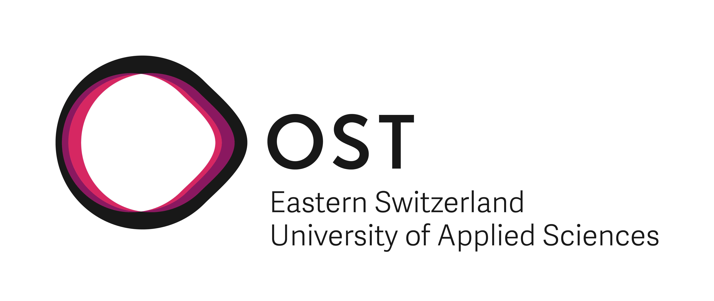

# [Cactus](https://cactus.projects-ost.ch/)

    

Welcome to Project Cactus!

"Is my favourite UI library accessible?" - "What UI Frameworks could I choose for my project that gives me a headstart in accessibility?" These are the questions project cactus tries to answer!

## Structure

The project is built on two containers:

**`frontend/`**

contains the frontend, a client for providing the website. It uses the [React library](https://reactjs.org/)

[More details](/frontend/README.md)

**`backend/`**

contains the backend of this application. It processes the db calls and handle the authentication. It's based on the [NestJs](https://nestjs.com/) processive node framework.

[More details](/backend/README.md)

## Hosting and Persistence

The newest production-ready release of this application is hosted by the Eastern Switzerland University of Applied Sciences (OST). In the background a [mongo DB](https://www.mongodb.com/) stores the test results and user profiles.

### Deployment

[Dev Branch Deployment](https://cactus-dev.sifs0003.infs.ch/)
[Main Branch Deployment](https://cactus.projects-ost.ch/)

## Contribution

We appreciate your interest in contributing to our project. There are two mainly focused ways to contribute this project showed in this visualization.

All possible ways how you can contribute and the appropriate guidelines will you find in [CONTRIBUTING.md](/CONTRIBUTING.md)

## Support

**Funding**

**Maintaining and Development**

## License

[MIT](./LICENSE)

Copyright (c) 2022-present OST
